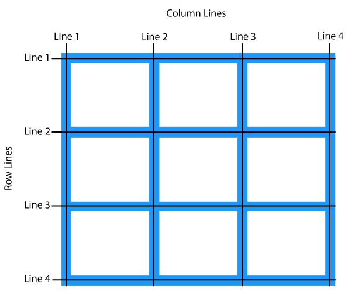

> **本文“发表于微博自媒体”，微博：[@钻石草帽](https://weibo.com/strawhatchan)**

# 内容提要
**本文采用知识库的方式，记录CSS以下各方面内容：**
1. 相关概念
2. 一般样式和高级样式（按照样式类型安排内容）
3. 其他内容，包括反应式和格子框
4. 参考资料

# 概述
## 简介
CSS是一门用于描述HTML元素显示方式的语言
- 发明原因。由于HTML无法给网页添加标签，而是描述网页内容，比如`<h1>This is a heading</h1>`，如果要添加像`<font>`这样的标签及其属性，那么，在开发大型网站项目时，不仅有大量页面，同时每个HTML文件也将变得很长，为了实现开发目的并提高开发效率，W3C发明了CSS
- 功能。CSS可同时控制多个页面的显示，包括设计、布局、不同设备的显示变化以及尺寸等，大幅提高设计效率
- 文件类型。外部样式表（stylesheets）存储于`.css`文件中，只需要修改单个文件即可对整个网站的展示形式进行修改，节省了大量工作

## 语法
- CSS语法通常是由选项（Selector）和声明（Declaration）组成，如`h1 {color:blue; font-size:12px;}`
    - `h1`表示选项，作用是基于HTML元素标签名称、id、class、属性及其他具有标识意义的内容来选择，可以理解为CSS和HTML之间的一座桥梁
    - 如果只有1个选项，选项后留1个空格，再用`{}`囊括所有声明；如果同时表示多个选项，选项之间使用`,`分隔，最后1个选项后留1个空格，再用`{}`囊括所有声明
    - `color:blue;`和`font-size:12px;`各是1个声明
    - **每个声明都由`name:value`，即“名称-值”对组成**
    - 如果`value`包含数值和单位，不能在数值和单位之间加空格符
    - 所有的声明（包括最后1个）都需要在末尾添加`;`（semicolon）作为声明与声明之间的分隔符
- 选项类型
    - 元素标签名称，例如`<p>`标签中的`p`，选项写`p`
    - id，例如`id="para1"`，选项写`#para1`
    - class，例如`class="center"`，对整个类起作用时，选项写`.center`；对特定类中的特定HTML元素起作用时，如`<p>`元素，选项写`p.center`
    - 属性（attribute），可通过`a[attribute] {stylesheet: stylevalue；}`调用。
        - [attribute]，所有特定属性
        - [attribute="value"]，所有等于特定值的特定属性
        - [attribute～="value]"，所有包含特定值内容的特定属性，该特定值必须是独立的、完整的值
        - [attribute|="value"]，所有以特定值开头的特定属性，该特定值必须是独立的、完整的值，例如top-text中的top，但不能是topcontent中的top
        - [attribute^="value"]，所有以特定值开头的特定属性，不需要是独立的、完整的值
        - [attribute$="value"]，所有以特定值结尾的特定属性，不需要是独立的、完整的值
        - [attribute*="value"]，所有包含特定值内容的特定属性，不需要是独立的、完整的值
        - a[attribute]，所有a元素中的特定属性
        - a[attribute="value"]，所有a元素中等于特定值的特定属性，并且所有对属性和属性值的其他连接符，如`~=`、`|=`、`^=`、`$=`、`*=`，都有有效
    - 伪元素和伪类，即`::Pseudo-elementName`和`:Pseudo-className`
    - 规则
        - 编码，@charset
        - 字体，@font-face
        - 动画，@keyframes
        - 引入，@import
        - 媒体，@media
    - 一份完整的CSS选项列表可查阅[CSS Selector Reference](https://www.w3schools.com/cssref/css_selectors.asp)
- 选项组合
    - 组合子（combinator）用于解释选项之间的关系
    - `“,”`，所有元素，即匹配用逗号分隔的所有元素
    - 空格，后裔选项（descendant selector），即匹配特定元素的所有后裔选项，包括子选项、孙选项等，例如，`div p {backgroud-color:yellow;}`匹配div元素中的所有p元素
    - `“>”`，子选项（child selector），即仅匹配特定元素的子选项，例如，`div > p {backgroud-color:yellow;}`仅匹配div元素中的下一级的p元素，不包括其他元素或者其他元素中的p元素
    - `“+”`，邻近兄弟选项（adjacent sibling selector），即匹配特定元素外的第1个邻近元素，例如，`div + p {backgroud-color:yellow;}`匹配div元素结束后的第1个p元素
    - `“～”`，一般兄弟选项（general sibling selector），即匹配特定外的所有兄弟选项，例如，`div ～ p {backgroud-color:yellow;}`匹配div元素结束后的所有p元素，即使后续的2个p元素间存在其他元素
    - 一份完整的选项结果测试可查阅[CSS Selector Tester](https://www.w3schools.com/cssref/trysel.asp)
- 注释
    - 注释标记为`/* comments */`
    - 注释既可以在1行内，也可以囊括多行
- 语法规范（如果某条语法包含多个声明，为便于阅读，应采用多行书写方式）
    - 将选项和开始的大括号置于第1行，并在开始的大括号前留一个空格
    - 在所有“名称-值”对后加上分号，包括最后一个“名称-值”对
    - 只有当值存在空格时，才使用双引号
    - 将关闭的大括号单独作为一行，且括号前不要有空格
    - 避免每行超过80个字符

## stylesheet的引用方式
- 外部引用，链接至CSS文件，用于为大量页面设置样式。在`<head>`元素中添加`<link>`元素，如`<head><link rel="stylesheet" type="text/css" href="mystyle.css"></head>`
- 页面引用，用于为单个页面设置独立的样式。在`<head>`元素中添加`<style>`元素
- 行内引用，用于为HTML文件内的特定元素设定样式。在HTML元素的开始标签内添加`style`属性
- 引用顺序
    - 行内引用覆盖外部引用和页面引用
    - 外部引用和页面引用按照排序确定覆盖关系，即在HTML文件内的`<head>`元素中“谁在后，谁起作用”
    - 如果前述3类引用方式都不存在，则使用浏览器默认样式

## 共有属性值或规范
共有属性值或规范是指所有或部分样式属性都可以使用的属性值或规范
- 共有属性值
    - initial：将属性设为默认属性
    - inherit：从父元素中继承属性
- 共有方向属性值规范
    - 4个值：依次表示上、右、下、左
    - 3个值：依次表示上、右和左、下
    - 2个值：依次表示上和下、右和左
    - 1个值：表示所有方向都相同
- 共有角属性值规范
    - 4个值：依次表示左上角、右上角、右下角、左下角
    - 3个值：依次表示左上角、右上角和左下角、右下角
    - 2个值：依次表示左上角和右下角、右上角和左下角
    - 1个值：表示所有角都相同

## 长度单位
- 绝对长度
    - px（像素单位依赖于设备，对于低分辨率设备，1px为1个设备像素，但对于打印机或这高分辨率屏幕，1px意味着多个设备像素）
    - cm（厘米）
    - mm（毫米）
    - in（英尺，1in=96px=2.54cm）
    - pt（点，1pt=1/72in）
    - pc（派卡，1pc=12pt）
- 相对长度
    - em：相对于元素的字体大小，1em表示字体大小的1倍
    - ex：相对于当前字体大小的x高度（极少使用）
    - ch：相对于0的宽度
    - rem：相对于根元素的字体大小
    - vw：相对于viewport的1%的宽度
    - vh：相对于viewport的1%的高度
    - vmin：相对于viewport小尺寸的1%
    - vmax：相对于viewport大尺寸的1%
    - %：相对于父元素的百分比

## 特性
特性（specificity）是指，当2个或2个以上的CSS规则冲突时，CSS将遵循一定的规则来决定哪项规则胜出，可以将特性理解为一个计分或排位，分高者胜出
- 特性层级
    - 行内样式
    - IDs
    - 类、属性（attribute）和伪类
    - 元素和伪元素
- 内存计分
    - 开始于0
    - 每个样式属性（attribute）+1000分
    - 每个ID+100分
    - 每个属性（attribute）、类或伪类+10分
    - 每个元素或伪元素+1分
- 规则
    - 最近规则，即如果2条或2条以上的相同规则，以最近写的规则为准
    - ID选项高于属性（attribute）选项
    - 上下文选项高于单个元素选项，可粗略理解为当前文件内的定义比文件外定义高、越近的定义比越远的定义高
    - 类选项高于元素选项

## 变量
- 可通过CSS标签声明变量，在:root或者body标签中的变量为全局变量，在其他标签中的变量为局部变量
- 变量名称必须以`--`开头，并且大小写敏感
- 变量语法：`var(custom-name, value)`，其中，custom-name为必要项，value可省略

## 媒体查询
CSS3的媒体查询（Media Queries）是从CSS2的媒体类型发展而来，不再寻找设备类型，而是查看设备能力；媒体查询可检查诸多事项，例如，viewport的高和宽、设备的高和宽、平板和手机的拜访方向、解析度等；使用媒体查询可以为不同设备定制样式表单
- Media Queries实质是一个条件语句，只有当条件满足时，才应用其定义的样式
- 调用方式
    - CSS元素内，`@media not|only mediatype and (media feature and|or|not mediafeature) {CSS-Code;}`
    - `<head>`元素内，`<link rel="stylesheet" media="mediatype and|not|only (expressions)" href="CSSFilePath">`
- mediatype
    - all：所有类型的设备
    - print：打印机
    - screen：电脑、平板、手机等屏幕
    - speech：屏幕阅读器
- 详细内容见[Media Features](https://www.w3schools.com/cssref/css3_pr_mediaquery.asp)

|                 |                  | Media Features值 |                  |                 |
| :-------------- | :--------------- | :--------------- | :--------------- | --------------- |
| any-hover       | any-pointer      | aspect-ratio     | color            | color-gamut     |
| color-index     | grid             | height           | hover            | inverted-colors |
| light-level     | max-aspect-ratio | max-color        | max-color-index  | max-height      |
| max-monochrome  | max-resolution   | max-width        | min-aspect-ratio | min-color       |
| min-color-index | min-height       | min-monochrome   | min-resolution   | min-width       |
| monochrome      | orientation      | overflow-block   | overflow-inline  | pointer         |
| resolution      | scan             | scripting        | update           | width           |

```css
/* 多个Media features示例 */
/* When the width is between 600px and 900px OR above 1100px - change the appearance of <div> */
@media screen and (max-width: 900px) and (min-width: 600px), (min-width: 1100px) {
  div.example {
    font-size: 50px;
    padding: 50px;
    border: 8px solid black;
    background: yellow;
  }
}
```

# 样式描述
## 颜色
- HTML支持140种颜色，详细信息可查阅[HTML Color Names Sorted by Name](https://www.w3schools.com/colors/colors_names.asp)或者[HTML Color Names Sorted by HEX Value](https://www.w3schools.com/colors/colors_hex.asp)
- 颜色属性
    - 背景颜色：backgroud-color
    - 文本颜色：color
    - 边框颜色：border
- 颜色的表示方式：RGB、HEX、HSL、RGBA、HSLA
    - RGB的格式为`rgb(red, green, blue)`，其中，`red`、`green`和`blue`的取值范围均为[0,255]
    - HEX的格式为`#rrggbb`，其中，`rr`、`gg`和`bb`的取值为[0,255]的十六进制数值
    - HSL的格式为`hsl(hue, saturation, lightness)`，其中，`hue`的取值范围为[0,360]，`saturation`的取值范围为[0%, 100%]，`Lightness`的取值范围为[0%, 100%]
    - RGBA的格式为`rgba(red, green, blue, alpha)`，其中，`alpha`表示透明度，取值范围为[0.0,1.0]
    - HSLA中的格式为`hsla(hue, saturation, lightness, alpha)`，其中，`alpha`表示透明度，取值范围为[0,1]

## 背景
- background背景属性用于为元素定义背景
    - 背景属性可以在一行中设定，只需要按照顺序填写背景属性下各属性的值即可，即`background: bg-color bg-image position/bg-size bg-repeat bg-origin bg-clip bg-attachment initial|inherit;`
- 背景属性下的属性（按前述属性的顺序）
    - 颜色：backgroud-color
        - color：颜色名称
        - transparent：透明
    - 图片：backgroud-image，注意不要使用影响文本显示的图片
        - url('URL'):设定图片URL
        - none：没有背景图片
        - linear-gradient()：线性渐变，至少定义2种颜色（从上到下），调用方式：`background: linear-gradient(direction | angle, color-stop1, color-stop2, ...);`，其中，direction用`to bottom | top | left | right`或者组合表示，angle用`Numberdeg`表示，number为数值，允许负数，deg为固定字符
        - radial-gradient()：径向渐变，至少定义2种颜色（中心到边缘），调用方式：`background: radial-gradient(shape size at position, start-color, ..., last-color);`
        - repeating-linear-gradient()：重复线性渐变
        - repeating-radial-gradient()：重复径向渐变
    - 位置：backgroud-position
        - left top
        - left center
        - left bottom
        - right top
        - right center
        - right bottom
        - center top
        - center center
        - center bottom
        - x% y%：百分比位置，左上角为0% 0%，右下角为100% 100%，x控制水平，y控制垂直
        - xpos ypos：像素位置，单位px，左上角0 0，右下角为最大的水平和垂直像素数值，xpos控制水平，ypos控制垂直
    - 大小：background-size
        - auto：默认属性，展示原始尺寸
        - length：设定宽和高，需要2个数值，第1个数值控制宽度，第2个数值控制高度
        - percentage：根据父元素的宽和高设定百分比，需要2个数值，第1个数值控制宽度，第2个数值控制高度
        - cover：改变背景图片大小覆盖整个容器
        - contain：改变图片到小，以展示整个图片
    - 重复：backgroud-repeat
        - no-repeat：不重复
        - repeat-x：水平重复
        - repeat-y：垂直重复
    - 位置的起始位置：background-origin
        - padding-box：默认选项，左上角填充区域开始
        - border-box：左上角边框区域开始
        - content-box：左上角文本区域开始
    - 延伸界限：background-clip
        - padding-box：延伸到填充区域
        - border-box：默认选项，延伸到边框区域
        - content-box：延伸到文本区域
    - 滚动：backgroud-attachment
        - scroll：默认选项，随页面滚动
        - fixed：不随页面滚动
        - local：随元素内容滚动
    - 多图层展示：background-blend-mode
        - normal：默认选项，含多个图层时选择最上的图层
        - multiply：展示所有图层
        - screen
        - overlay
        - darken
        - lighten
        - color-dodge
        - saturation
        - color
        - luminosity

## 边框
- 边框：border
    - 调用方式`border: border-width border-style border-color|initial|inherit;`
- 边框宽度：border-width
    - 数字+长度单位，如10px、10cm
    - 字符
        - medium：默认属性，中型边框
        - thin：细型边框
        - thick：粗型边框
    - 遵循共有方向属性值规范
- 边框样式：border-style
    - dotted：点
    - dashed：短线
    - solid：实线
    - double：双层线
    - groove：槽边框（右和下阴影）
    - ridge：岭边框（左和上阴影）
    - inset：边框右和下淡化
    - outset：边框左和上淡化
    - none：无边框
    - hidden：隐藏边框
    - mix：混合型边框，遵循共有方向属性值规范，用空格分隔
- 边框颜色：border-color
    - color：颜色名称
    - transparent：透明
    - 遵循共有方向属性值规范
- 边框组合：border-collapse
    - separate：默认选项，单元格和表格都是独立的边框
    - collapse：单元格和表格共用1个边框
- 边框间隔：border-spaceing
    - 1个数值+长度单位的值：表示水平和垂直间隔相同
    - 2个数值+长度单位的值：第1个控制水平间隔，第2个控制垂直间隔
- 边框四角半径：border-radius
    - 数字+长度单位，如10px、10cm
    - 百分比符号%
    - 遵循共有角属性值规范
- 图片边框：border-image
    - 既可在一行中调用，如`border-image:source slice width outset repeat|initial|inherit;`，也可分开调用
    - border-image-source：设定资源
        - none：无图片
        - URL：图片URL
    - border-image-slice：切片，将图片源切成9个部分，包括4个角、4个边、1个中心，4角和4边不透明，中心透明，但如果使用fill参数，中心由透明变为不透明；切片后的图片与边框之间的关联机制：首先，将整个边框和边框包围的内容理解成“内容中心+4个角+4个边”的9个部分；其次，将切片图片的4个角分别放在边框的4个角，不执行其他操作；然后，将切片图片的4个边分别放在边框的4个边，中心放在中心，可以执行重复、平铺操作；最后，如果包含fill参数，则将中心从透明变成不透明
        - 数值（不带单位，默认单位为px）：可以有4值，如果第4个值忽略，则与第2个值相同；如果继续忽略第3个值，则3和1相同，4和2相同；如果继续忽略第2个值，则都相同；4个值依次表示，从上向下切一刀的位置、从右向左切一刀的位置、从下向上切一刀的位置、从左向右切一刀的位置，一张图片切4刀后即分成9个部分
        - 百分比：可有4个值，含义与数值类似，只是按照百分比表示
        - fill：对中心区域是否透明的控制参数，有该参数表示不透明，反之则反，用空格与数值或百分比分隔
    - border-image-width：边框的宽度
        - 数值+像素单位：像素宽度，可以有4个值
        - 数值：相应边框的倍数，可以有4个值
        - 百分比：与切片图像相应边的比例，上下为垂直比例、左右为水平比例，可以有4个值
        - auto：与切片图像的固有宽度和高度相适应
        - 有4个值的属性值遵循共有方向属性值规范
    - border-image-outset：边框向外延伸的距离
        - 数值+像素单位：像素宽度，可以有4个值
        - 数值：相应边框宽度的倍数，可以有4个值
        - 有4个值的属性值遵循共有方向属性值规范
    - border-image-repeat：图片重复的方式
        - stretch：拉伸
        - repeat：简单重复图片以填满整个边框
        - round：简单重复，但如果相应图片切片部分不是以整数个图片填满整个边框，则重新调整图片大小，直到以整数个图片填满整个边框
        - space：简单重复，但如果相应图片切片部分不是以整数个图片填满整个边框，则重新调整空间大小，以使整个边框由整数个图片填满
- 控制不同方向的边框
    - border-top|right|bottom|left分别控制上、右、下、左的边框，调用模式为`border-top|right|bottom|left: border-width border-style border-color|initial|inherit;`
    - 每一个方向控制下都有width|style|color属性，即border-top|right|bottom|left-width|style|color，调用方式与width|style|color属性相同
    - top和bottom都有2个额外属性，即border-top|bottom-right|left-radius，用于控制边框4个角的半径，调用方式与radius属性相同

## 边框向外的扩展距离
- 边框向外的扩展距离：margin
    - 数值+长度单位：各个方向边框向外的扩展距离，默认值为0，允许负数，可以有4个值，遵循共有方向属性值规范
    - 百分比：所含元素内容宽度的百分比
    - auto：浏览器自行计算边界，可用于将块元素水平居中
- 不同方向上边框向外的扩展距离：margin-top|right|bottom|left分别控制上、右、下、左边框向外的扩展距离，调用方式与margin相同
    - 如果希望将1张图片居中，可通过同时这是`margin-left:auto`和`margin-right:auto`实现

## 边框内扩展内容边界
- 边框内扩展内容边界：padding
    - 数值+长度单位：边框内扩展内容边界的长度和宽度，默认值为0，可以有4个值，遵循共有方向属性值规范
    - 百分比：所含元素内容宽度的百分比
- 在不同方向上边框内扩展内容边界：padding-top|right|bottom|left分别控制向上、右、下、左扩展的距离，调用方式与padding相同

## 元素高与宽
- 元素的高：height
    - auto：浏览器计算高，默认选项
    - 数值+长度单位：元素的高
    - 百分比：块的高度百分比
- 元素的高：width
    - auto：浏览器计算宽，默认选项
    - 数值+长度单位：元素的宽
    - 百分比：块的宽度百分比
- 最大的高/宽：max-height/width
    - none：无最大高/宽，默认选项
    - 数值+长度单位：元素的最大高/宽
    - 百分比：块的最大高/宽百分比
- 最小的高/宽：min-height/width
    - 数值+长度单位：元素的最小高/宽，默认值为0
    - 百分比：块的最小高/宽百分比
- 宽和最大的宽/高和最大的高
    - 在使用`margin:auto`属性的前提下，当使用width/height属性时，如果浏览器宽/高小于设定的值，宽/高的边框不会自动适应浏览器的变化，即宽/高是绝对的
    - 在使用`margin:auto`属性的前提下，当使用max-height/width属性是，如果浏览器宽/高小于设定的值，宽/高的边框将自动适应浏览器的变化，即宽/高在最大值以内是浮动的，最大值以外是绝对的

## Box模型
Box模型在设计和布局时使用，它由透明的边框扩展、边框、透明的文本框扩展和文本组成，允许在元素周围添加边框以及定义元素间的空间


<p align="center"><mark>Box模型</mark></p>

- Box模型作用机制
    - 当在CSS中设置元素高/宽时，只是设置了内容区域的高/宽，如果要计算整个元素的尺寸，还需要加上文本框扩展、边框和边框扩展区域
        - 元素宽度=width + left padding + right padding + left border + right border + left margin + right margin
        - 元素高度=height + top padding + bottom padding + top border + bottom border + top margin + bottom margin
- 轮廓：outline，处于边框以外、边框扩展以内的部分，调用方式：`outline: outline-width outline-style outline-color|initial|inherit;`
    - 宽度：outline-width
        - 文字描述：medium|thin|thick，默认值为medium
        - 数字+长度单位
    - 样式：outline-style
        - none：默认值，无轮廓
        - hidden：隐藏
        - dotted：点
        - dashed：短线
        - solid：实线
        - double：双层线
        - groove：槽轮廓（右和下阴影，3D）
        - ridge：岭轮廓（左和上阴影，3D）
        - inset：轮廓右和下淡化（3D）
        - outset：轮廓左和上淡化（3D）
    - 颜色：outline-color
        - invert：默认值，倒转颜色
        - color：颜色名称及其他表达方式
    - 空间：outline-offset
        - 数字+长度单位：定义边框以外、轮廓以内的长度
- box-sizing，用于决定一个元素的高/宽如何计算，即是否将padding和border计算在内，调用方式：`box-sizing: content-box|border-box|initial|inherit;`
    - content-box：默认选项，padding和border不计算在内
    - border-box：padding和border计算在内
- box-shadow，为元素添加1个或多个阴影，调用方式：`box-shadow: none|h-offset v-offset blur spread color |inset|initial|inherit;`
    - none：默认选项，无阴影
    - h-offset：必要项，水平阴影，允许负数，正数右边、负数左边
    - v-offset：必要项，垂直阴影，允许负数，正数下方、负数上方
    - blur：模糊半径，数值越大越模糊
    - spread：传播半径，阴影半径调节，允许负数，正数扩大、负数缩小
    - color：颜色名称以及其他表示颜色的方式
    - inset：将阴影从元素外部调整到元素内部
- box-decoration-break，当某个元素被多个元素分隔时，如何对这些被分隔的元素应用设定的单个样式
    - slice：默认选项，仍将被分隔的元素作为一个整体，并将样式切片
    - clone：将被分隔的每一个元素都作为一个独立的元素来应用样式
- resize，用户可自定义容器大小
    - none：默认选项，用户不能调整大小
    - both：可调整高和宽
    - horizontal：可调整宽
    - vertical：可调整高

## 文本
- color
    - 颜色名称和其他表示方式均可
- text-align
    - left：默认值，左边
    - center：中间
    - right：右边
    - justify：行拉伸，以使每行都等于宽度
- text-align-last，用于确定所有文本最后一样的分布，调用方式：`text-align-last: auto|left|right|center|justify|start|end|initial|inherit;`
    - auto：默认选项，左侧
    - left：左侧
    - right：右侧
    - center：居中
    - justify：两端对齐
    - start：如果text-direction是left-to-right则为左，是right-to-left则为右
    - end：与start相反
- text-justify，两端对齐，调用方式：`text-justify: auto|inter-word|inter-character|none|initial|inherit;`
    - auto：浏览器决定对齐算法
    - inter-word：增加或减少单词或字之间的间隙
    - inter-character：增加或减少字符之间的间隙
    - none：取消两端对齐方法无效
- text-decoration，调用方式`text-decoration: text-decoration-line text-decoration-color text-decoration-style|initial|inherit;`
    - text-decoration-line
        - none：默认选项，无横线
        - underline：下划线
        - overline：上划线
        - line-through：中间划线
    - text-decoration-color
        - 颜色名称和其他表示方式均可
    - text-decoration-style
        - solid：实线
        - double：双线
        - dotted：点
        - dashed：短线
        - wavy：波浪线
- text-transformation
    - none：默认值，无大写，即输入什么展示什么
    - uppercase：全部大写
    - lowercase：全部小写
    - capitalize：所有首字母大写
- text-indent
    - 数值+像素单位：首行缩进距离
    - %，父元素宽度百分比
- letter-spacing
    - normal：默认选项，没有间隙
    - 数值+像素单位：允许负数，每个字符之间的间隙（注意，不是字或单词，是字符）
- line-height
    - normal：默认选项，标准行高
    - 数值：任意数值，包括负数，相对于字体大小的倍数
    - 数值+长度单位：固定的行高
    - %：相对于字体大小的百分比
- direction
    - rtl：文本方向从左到右
    - ltr：文本方向从右到左
- word-spacing
    - 数值+像素单位：允许负数，每个字或单词之间的间隙
- word-wrap，允许长字符被切断并换行，调用方式：`word-wrap: normal|break-word|initial|inherit;`
    - normal：仅在允许的断点切换单词或字
    - break-word：允许不可切断的字被切断
- word-break，决定单词或字在行末的断行方式，调用方式：`word-break: normal|break-all|keep-all|initial|inherit;`
    - normal：默认选项，默认的断行规则
    - break-all：阻止溢出，单词（不包括CJK文本）可能在任何字符处被断行
    - keep-all：非CJK文本与normal相同
    - break-word：阻止溢出，单词或字将在随机点被切断
- text-shadow，调用方式`text-shadow: h-shadow v-shadow blur-radius color|none|initial|inherit;`
    - h-shadow，数值+像素单位，允许负数，水平阴影长度
    - v-shadow，数值+像素单位，允许负数，垂直阴影长度
    - blur-radius，模糊半径，默认值为0
    - color，颜色名称及其他表示方式，阴影颜色
- text-overflow，调用方式：` text-overflow: clip|ellipsis|string|initial|inherit;`
    - clip：直接修剪
    - ellipsis：将被修剪的内容用`...`表示
    - string：将被修剪内容用给定的字符串表示
- unicode-bidi，与direction属性联合使用，来设置或返回是否应覆盖文本以支持同一文档中的多种语言；调用方式：`unicode-bidi: normal|embed|bidi-override|initial|inherit;`
    - normal：默认设置，元素不打开增加的嵌层
    - embed：对行内元素打开增加的嵌层
    - bidi-override：对行内元素创建覆盖层
    - isolate：元素独立于其他元素
    - isolate-override
    - plaintext
- vertical-align，调用方式：`vertical-align: baseline|length|sub|super|top|text-top|middle|bottom|text-bottom|initial|inherit;`
    - baseline：默认选项，与父基线相同
    - 数值+长度单位：提升或降低元素的位置，允许负数
    - %：提升或降低行高的百分比
    - sub：父基线的下角标
    - super：父基线的上角标
    - middle：父元素的中间
    - top：与同行元素的最高者相同
    - bottom：与同行元素的最低者相同
    - text-top：与父元素的最高字体相同
    - text-bottom：与父元素的最低字体相同
- white-space，调用方式：`white-space: normal|nowrap|pre|pre-line|pre-wrap|initial|inherit;`
    - normal：默认选项，多个空白符被压缩成1个空白符，文本将在必要时换行
    - nowrap：多个空白符被压缩成1个空白符，文本将在遇到`<br />`空元素时才换行
    - pre：浏览器保留空白符，文本只在遇到断行符时才换行
    - pre-line：多个空白符被压缩成1个空白符，文本将在必要时或者遇到断行符时换行
    - pre-wrap：浏览器保留空白符，文本将在必要时或者遇到断行符时换行
- word-spacing，调用方式：`word-spacing: normal|length|initial|inherit;`
    - normal：默认选项，定义单词或字间距为0.25em
    - 数值+长度单位：允许负数
- quotes，为文本添加符号，调用方式：`quotes: none|string|initial|inherit;`
    - none：不添加符号
    - string：可有偶数个符号，如str1 str2 str3 str4，则str1和str2表示对最外层添加符号，str3和str4表示对第2层添加符号，如果有6个、8个或者更多偶数个符号，则以此类推

| 结果 | 描述                        | CSS实体 |
| ---- | --------------------------- | ------- |
| "    | double quote                | \0022   |
| '    | single quote                | \0027   |
| <    | single, left angle quote    | \2039   |
| >    | single, right angle quote   | \203A   |
| «    | double, left angle quote    | \00AB   |
| »    | double, right angle quote   | \00BB   |
| ‘   | left quote (single high-6)  | \2018   |
| ’   | right quote (single high-9) | \2019   |
| “   | left quote (double high-6)  | \201C   |
| ”   | right quote (double high-9) | \201D   |
| „    | double quote (double low-9) | \201E   |

## 字体
- 字体类型
    - generic family
        - Serif：在一些字符的结束处有一些细线
        - Sans-serif：在字符的结束处没有细线，在电脑屏幕上，Sans-serif比Serif更容易阅读
        - Monospace：所有字符都有相同的宽度
    - Font family
        - Times New Roman
        - Georgia
        - Arial
        - Verdana
        - Courier New
        - Lucida Console
    - 网页安全字体组合
        - 原则：以想要的字体开始，以generic family结束
        - 具体组合可查阅[CSS Web Safe Font Combinations](https://www.w3schools.com/cssref/css_websafe_fonts.asp)
- @font-face
    - @font-face规则可帮助用户使用尚未安装在本地的字体类型，实现机制是定义并指定字体URL，用户浏览时自动从URL下载该字体
    - font-family：必要项，自定义字体名称
    - src：必要项，字体的URL
    - font-stretch：可选项，决定字体将如何被拉伸
        - normal：默认选项
        - condensed
        - ultra-condensed
        - extra-condensed
        - semi-condensed
        - expanded
        - semi-expanded
        - extra-expanded
        - ultra-expanded
    - font-style：可选项
    - font-weight：可选项
    - unicode-range：可选项，定义字体支持从Unicode字符范围，默认值为“U+0-10FFFF”
- font，调用方式：`font: font-style font-variant font-weight font-size/line-height font-family|caption|icon|menu|message-box|small-caption|status-bar|initial|inherit;`
- fort-family
    - 文本字体通过font-family属性设定，应将该属性理解为反馈式系统，即当浏览器不支持第1个字体时，册尝试第2个，以此类推
    - 如果字体名称多于1个字符，则应使用双引号
    - 如果同时设定多个字体，字体名称之间使用`,`分隔
    - 如果要使用Google字体，在`<head>`元素中加入`<link href='https://fonts.googleapis.com/css?family=GoogleFontName' rel='stylesheet'>`，GoogleFontName包含877种字体，字体列表具体见[How TO - Google Fonts](https://www.w3schools.com/howto/howto_google_fonts.asp)
- font-size，调用方式：`font-size:medium|xx-small|x-small|small|large|x-large|xx-large|smaller|larger|length|initial|inherit;`
    - medium：默认选项，中号字体
    - xx-small：xx-small号字体
    - x-small：x-small号字体
    - small：small号字体
    - large：large号字体
    - x-large：x-large字体
    - xx-large：xx-large号字体
    - smaller：小于父元素字号
    - larger：大于父元素字号
    - 数值+长度单位：固定大小
    - %：父元素字体大小的百分比
- font-style，调用方式：`font-style: normal|italic|oblique|initial|inherit;`
    - normal：默认选项，常用字体样式
    - italic：斜体
    - oblique：斜体
- font-variant，调用方式：`font-variant: normal|small-caps|initial|inherit;`
    - normal：默认选项，常用字体
    - small-caps：所有小写字体变为大写，但比正常的大写字母要小
- font-weight，调用方式：`font-weight: normal|bold|bolder|lighter|number|initial|inherit;`
    - normal：默认选项，常用字体
    - bold：粗体
    - bolder：更粗的粗体
    - lighter：细体
    - 100-900：400与normal相同，700与粗体相同

## 图标
- 类型
    - Font Awesome
    - Bootstrap
    - Google
- 调用方式
    - 在`<head>`元素中加入Font Awesome、Bootstrap或者Google的样式链接
        - Font Awesome为`<link rel="stylesheet" href="https://cdnjs.cloudflare.com/ajax/libs/font-awesome/4.7.0/css/font-awesome.min.css">`
        - Bootstrap为`<link rel="stylesheet" href="https://maxcdn.bootstrapcdn.com/bootstrap/3.3.7/css/bootstrap.min.css">`
        - Google为`<link rel="stylesheet" href="https://fonts.googleapis.com/icon?family=Material+Icons">`
    - Font Awesome和Bootstrap通过`<i class="iconName"></i>`或`<span class="iconName></span>`元素调用图标；Google通过`<i class="material-icons">iconName</i>`元素调用图标
- 完整的图标列表查阅[Icon Reference](https://www.w3schools.com/icons/icons_reference.asp)

## 链接
- 链接状态
    - `a:link`：一般的、没有访问过的链接
    - `a:visited`：已访问的链接
    - `a:hover`：鼠标接触的链接
    - `a:active`：点击过的链接
- 设置链接样式时的规则
    - `a:hover`必须在`a:link`和`a:visited`之后
    - `a:active`必须在`a:hover`之后

```html
<!-- 不同的链接类型 -->
<!DOCTYPE html>
<html>
<head>
<style>
a.one:link {color:#ff0000;}
a.one:visited {color:#0000ff;}
a.one:hover {color:#ffcc00;}

a.two:link {color:#ff0000;}
a.two:visited {color:#0000ff;}
a.two:hover {font-size:150%;}

a.three:link {color:#ff0000;}
a.three:visited {color:#0000ff;}
a.three:hover {background:#66ff66;}

a.four:link {color:#ff0000;}
a.four:visited {color:#0000ff;}
a.four:hover {font-family:monospace;}

a.five:link {color:#ff0000;text-decoration:none;}
a.five:visited {color:#0000ff;text-decoration:none;}
a.five:hover {text-decoration:underline;}
</style>
</head>
<body>

<p>Mouse over the links and watch them change layout:</p>

<p><b><a class="one" href="default.asp" target="_blank">This link changes color</a></b></p>
<p><b><a class="two" href="default.asp" target="_blank">This link changes font-size</a></b></p>
<p><b><a class="three" href="default.asp" target="_blank">This link changes background-color</a></b></p>
<p><b><a class="four" href="default.asp" target="_blank">This link changes font-family</a></b></p>
<p><b><a class="five" href="default.asp" target="_blank">This link changes text-decoration</a></b></p>

</body>
</html>
```

```html
<!-- 按钮链接 -->
<!DOCTYPE html>
<html>
<head>
<style>
a:link, a:visited {
    background-color: white;
    color: black;
    border: 2px solid green;
    padding: 10px 20px;
    text-align: center;
    text-decoration: none;
    display: inline-block;
}

a:hover, a:active {
    background-color: green;
    color: white;
}
</style>
</head>
<body>

<a href="default.asp" target="_blank">This is a link</a>

</body>
</html>
```

```html
<!-- 鼠标状态 -->
<!DOCTYPE html>
<html>
<body>

<p>Mouse over the words to change the cursor.</p>
<span style="cursor:auto">auto</span><br>
<span style="cursor:crosshair">crosshair</span><br>
<span style="cursor:default">default</span><br>
<span style="cursor:e-resize">e-resize</span><br>
<span style="cursor:help">help</span><br>
<span style="cursor:move">move</span><br>
<span style="cursor:n-resize">n-resize</span><br>
<span style="cursor:ne-resize">ne-resize</span><br>
<span style="cursor:nw-resize">nw-resize</span><br>
<span style="cursor:pointer">pointer</span><br>
<span style="cursor:progress">progress</span><br>
<span style="cursor:s-resize">s-resize</span><br>
<span style="cursor:se-resize">se-resize</span><br>
<span style="cursor:sw-resize">sw-resize</span><br>
<span style="cursor:text">text</span><br>
<span style="cursor:w-resize">w-resize</span><br>
<span style="cursor:wait">wait</span><br>
<span style="cursor:not-allowed">not-allowed</span><br>

</body>
</html>
```

## 列表
- CSS列表属性可以完成以下事项
    - 为有序列表设定不同的列表标签
    - 为无需列表设定不同的列表标签
    - 将图片作为列表标签
    - 为列表和列表中的要素添加背景颜色
- list-style，调用方式`list-style: list-style-type list-style-position list-style-image|initial|inherit;`
- list-style-type
    - disc：黑色圆点
    - armenian
    - circle：空心圆圈
    - cjk-ideographic：中文数字
    - decimal：数字
    - decimal-leading-zero：第1位为0的数字
    - georgian
    - hebrew
    - hiragana
    - hiragana-iroha
    - katakana
    - katakana-iroha
    - lower-alpha：小写字母
    - lower-greek：小写希腊字母
    - lower-latin：小写字母
    - lower-roman：小写罗马字母
    - none：无标签
    - square：方形
    - upper-alpha：大写字母
    - upper-greek：大写希腊字母
    - upper-latin：大写字母
    - upper-roman：大写罗马字母
- list-style-position，调用方式：`list-style-position: inside|outside|initial|inherit;`
    - inside：列表标签在列表项内
    - outside：列表标签在列表项外
- list-style-image，调用方式：`list-style-image: none|url|initial|inherit;`
    - none：默认选项，无图片，使用`list-style-type`定义的图标类型
    - url：`url(ImagePath)`，其中，ImagePath为图片路径

## 表格
- 表格主要使用边框样式，除边框样式以外还有3种属性，分别为caption-side、empty-cells和table-layout
- caption-side，调用方式：`caption-side: top|bottom|initial|inherit;`
    - top：默认选项，置于表格上方
    - bottom：置于表格下放
- empty-cells，调用方式：`empty-cells: show|hide|initial|inherit;`
    - show：默认选项，显示空单元格
    - hide：不显示空单元格
- table-layout，调用方式：`table-layout: auto|fixed|initial|inherit;`
    - auto：默认选项，浏览器使用自动表格布局算法
    - fixed：固定表格布局算法

```html
<!--  -->
<!DOCTYPE html>
<html>
<head>
<style>
#customers {
    font-family: "Trebuchet MS", Arial, Helvetica, sans-serif;
    border-collapse: collapse;
    width: 100%;
}

#customers td, #customers th {
    border: 1px solid #ddd;
    padding: 8px;
}
<!-- 表示偶数行有背景色，偶数even可以换成odd，表示奇数行 -->
#customers tr:nth-child(even){background-color: #f2f2f2;}
<!-- 表示鼠标所在行变化颜色 -->
#customers tr:hover {background-color: #ddd;}

#customers th {
    padding-top: 12px;
    padding-bottom: 12px;
    text-align: left;
    background-color: #4CAF50;
    color: white;
}
</style>
</head>
<body>

<table id="customers">
  <tr>
    <th>Company</th>
    <th>Contact</th>
    <th>Country</th>
  </tr>
  <tr>
    <td>Alfreds Futterkiste</td>
    <td>Maria Anders</td>
    <td>Germany</td>
  </tr>
  <tr>
    <td>Berglunds snabbköp</td>
    <td>Christina Berglund</td>
    <td>Sweden</td>
  </tr>
  <tr>
    <td>Centro comercial Moctezuma</td>
    <td>Francisco Chang</td>
    <td>Mexico</td>
  </tr>
  <tr>
    <td>Ernst Handel</td>
    <td>Roland Mendel</td>
    <td>Austria</td>
  </tr>
  <tr>
    <td>Island Trading</td>
    <td>Helen Bennett</td>
    <td>UK</td>
  </tr>
  <tr>
    <td>Königlich Essen</td>
    <td>Philip Cramer</td>
    <td>Germany</td>
  </tr>
  <tr>
    <td>Laughing Bacchus Winecellars</td>
    <td>Yoshi Tannamuri</td>
    <td>Canada</td>
  </tr>
  <tr>
    <td>Magazzini Alimentari Riuniti</td>
    <td>Giovanni Rovelli</td>
    <td>Italy</td>
  </tr>
  <tr>
    <td>North/South</td>
    <td>Simon Crowther</td>
    <td>UK</td>
  </tr>
  <tr>
    <td>Paris spécialités</td>
    <td>Marie Bertrand</td>
    <td>France</td>
  </tr>
</table>

</body>
</html>
```

## 显示与可见
- display，调用方式：`display: value;`
    - inline：行内显示，高/宽属性均无效
    - block：作为块元素，重起一行并占据整行
    - contents：取消容器并使子元素升级
    - grid：块grid容器
    - flex：块级的flex容器，调用方式：`flex: flex-grow flex-shrink flex-basis|auto|initial|inherit;`
    - inline-block：行内块容器
    - inline-flex：行内flex容器
    - inline-grid：行内grid容器
    - inline-table：行内表格
    - list-item：使元素像列表项一样
    - run-in：根据上下文决定是块还是行内
    - table：像`<table>`元素一样
    - table-caption：像`<caption>`元素一样
    - table-column-group：像`<colgroup>`元素一样
    - table-header-group：像`<thead>`元素一样
    - table-footer-group：像`<tfoot>`元素一样
    - table-row-group：像`<tbody>`元素一样
    - table-cell：像`<td>`元素一样
    - table-column：像`<col>`元素一样
    - table-row：像`<tr>`元素一样
    - none：完全移除整个元素并且不占用位置
- visibility，调用方式：` visibility: visible|hidden|collapse|initial|inherit;`
    - visible：默认选项，元素可见
    - hidden：元素隐藏，但占据位置
    - collapse：仅对`<tr>`、`<tbody>`、`<col>`、`<colgroup>`使用，不影响表格布局，但移除行或列，并且不占用空间

## 位置
- position，调用方式：`position: static|absolute|fixed|relative|sticky|initial|inherit;`
    - static：默认选项，静态位置，按照文件流而不是参数确定位置，其他参数位置参数无效
    - absolute：相对于第1父元素的位置，其他位置参数有效
    - fixed：相对于浏览器的位置，其他位置参数有效
    - relative：相对于其所属元素的位置，其他位置参数有效
    - sticky：相对于浏览器屏幕滚动的位置，在relative和fixed之间切换，当屏幕滚动的位置越过sticky属性时，从relative切换到fixed
- top，调用方式：`top: auto|length|initial|inherit;`
    - auto：默认选项，浏览器自动计算顶部位置
    - 数值+长度单位：顶部的绝对位置，允许负数，正数向下、负数向上
    - %：顶部相对于容器元素的百分比，允许负数
- bottom，调用方式：`bottom: auto|length|initial|inherit;`
    - auto：默认选项，浏览器自动计算底边位置
    - 数值+长度单位：底边的绝对位置，允许负数，正数向上、负数向下
    - %：底边相对于容器元素的百分比，允许负数
- left，调用方式：`left: auto|length|initial|inherit;`
    - auto：默认选项，浏览器自动计算左侧位置
    - 数值+长度单位：左侧的绝对位置，允许负数，正数向右、负数向左
    - %：左侧相对于容器元素的百分比，允许负数
- right，调用方式：`right: auto|length|initial|inherit;`
    - auto：默认选项，浏览器自动计算右侧位置
    - 数值+长度单位：右侧的绝对位置，允许负数，正数向左、负数向右
    - %：右侧相对于容器元素的百分比，允许负数
- z-index，调用方式：`z-index: auto|number|initial|inherit;`
    - auto：默认选项，栈的顺序与父元素相同
    - 数值：允许负数，调整栈的顺序
- clip，调用方式：`clip: auto|shape|initial|inherit;`
    - auto：默认选项，无剪切
    - shape：唯一值为`rect (top, right, bottom, left)`，其中的4个数值遵循共有方向属性值规范，形式为“数值+长度单位”

## 浮动
- 溢出是指，当内容的大小超过容器大小时，内容溢出容器的情形
    - overflow属性用于解决溢出问题
        - 决定是否剪切内容或者添加滚动条，以使内容适应区域大小
        - 只对有特定高的块元素起作用
    - overflow，调用方式：`overflow: visible|hidden|scroll|auto|initial|inherit;`
        - visible：默认选项，不剪切，溢出容器
        - hidden：剪切，隐藏溢出部分
        - scroll：剪切，添加滚动条
        - auto：如果溢出部分被剪切，则添加滚动条；如果容器包含2个及2个以上元素，则以最宽或最高的元素为基准设定边框，超出该基准后添加滚动条
    - overflow-x，调用方式以及属性与overflow相同，控制水平方向上的溢出
    - Overflow-y，调用方式以及属性与overflow相同，控制垂直方向上的溢出
- 浮动是指安排容器内特定元素是否浮动以及如何浮动
    - float，调用方式：`float: none|left|right|initial|inherit;`
        - none：默认选项，不浮动
        - left：将元素浮动到容器左侧
        - right：将元素浮动到容器右侧
- 清理是指安排容器内特定元素的特定方向是否禁用浮动
    - clear，调用方式：`clear: none|left|right|both|initial|inherit;`
        - none：默认选项，在左右两个方向上允许浮动
        - left：在左侧方向上禁用浮动
        - right：在右侧方向上禁用浮动
        - both：在左右两个方向上同时禁用浮动

## 透明
除使用RGBA、HSLA表示颜色时，用第4个值表示透明外，还可以直接使用`opacity:[0.0-1.0]`表示透明程度，0.0表示完全透明、1.0表示完全不透明

## 计数
CSS可使用counter-reset和counter-increment实现计数
- content，通常与[::after]和[::before]联合使用
- counter-increment
    - none：默认选项，不增加计数
    - id：以id决定计数的依据，每出现一次该id则按加法增加1个计数，也可以在id后加上`-1`按减法计数
- counter-reset
    - none：默认选项，不重置计数
    - id：以id决定是否重置计数，每当id出现时，则重置计数，默认值为0

```html
<!-- 章节和子章节计数示例 -->
<!DOCTYPE html>
<html>
<head>
<style>
body {
    counter-reset: section;
}

h1 {
    counter-reset: subsection;
}

h1::before {
    counter-increment: section;
    content: "Section " counter(section) ". ";
}

h2::before {
    counter-increment: subsection;
    content: counter(section) "." counter(subsection) " ";
}
</style>
</head>
<body>


<h1>HTML tutorials:</h1>
<h2>HTML Tutorial</h2>
<h2>CSS Tutorial</h2>

<h1>Scripting tutorials:</h1>
<h2>JavaScript</h2>
<h2>VBScript</h2>

<h1>XML tutorials:</h1>
<h2>XML</h2>
<h2>XSL</h2>

<p><b>Note:</b> IE8 supports these properties only if a !DOCTYPE is specified.</p>

</body>
</html>
```

## 转动
- transform，转动，调用方式：`transform: none|transform-functions|initial|inherit;`
    - 2D
        - none：无转动
        - matrix(n,n,n,n,n,n)：使用6个值的矩阵转动
        - translate(x,y)：水平和垂直位置
        - translateX(x)：水平位置
        - translateY(y)：垂直位置
        - scale(x,y)：在水平和垂直方向上的拉伸或压缩倍数
        - scaleX(x)：在水平方向上的拉伸或压缩倍数
        - scaleY(y)：在垂直方向上的拉伸或压缩倍数
        - rotate(angle)：转动角度，允许负数，正数顺时针、负数逆时针
        - skew(x-angle,y-angle)：在水平和垂直方向上的歪斜角度
        - skewX(angle)：在水平方向上的歪斜角度
        - skewY(angle)：在垂直方向上的歪斜角度
    - 3D
        - none：无转动
        - matrix3d(n,n,n,n,n,n,n,n,n,n,n,n,n,n,n,n)：使用4x4的16个值矩阵转动
        - translate3d(x,y,z)：3D图形位置
        - translateZ(z)：图形Z轴位置
        - scale3d(x,y,z)：在水平、垂直和Z轴上的拉伸或压缩倍数
        - scaleZ(z)：在Z轴上的拉伸或压缩倍数
        - rotate3d(x,y,z,angle)：转动角度
        - rotateX(x)：在水平方向上的转动角度
        - rotateY(y)：在垂直方向上的转动角度
        - rotateZ(z)：在Z轴上的转动角度
        - perspective(n)：查看视角
- transform-origin，调整已变元素的位置，调用方式：`transform-origin: x-axis y-axis z-axis|initial|inherit;`
    - x-axis
        - left
        - center
        - right
        - 数值+长度单位
        - %
    - y-axis
        - top
        - center
        - bottom
        - 数值+长度单位
        - %
    - z-axis
        - 数值+长度单位
- transform-style，决定是否以3d方式展示嵌套的图形
    - flat：默认选项，不以3d方式展示
    - preserve-3d：以3d方式展示

## 渐变
- transition，渐变效果，调用方式：`transition: property duration timing-function delay|initial|inherit;`
    - transition-property，定义渐变的属性
        - none：无渐变效果
        - all：默认选项，所有属性都渐变
        - property：使用`,`分隔需要渐变的CSS属性（properties）列表
    - transition-duration，渐变持续时间
        - time：默认值为0s（0秒），有2种单位，一种为s（秒），另一种为ms（毫秒）
    - transition-timing-function，渐变曲线
        - ease：默认选项，按照慢-快-慢的节奏渐变，等价于cubic-bezier(0.25,0.1,0.25,1)
        - linear：匀速渐变，等价于cubic-bezier(0,0,1,1)
        - ease-in：开始慢，等价于cubic-bezier(0.42,0,1,1)
        - ease-out：结束慢，等价于cubic-bezier(0,0,0.58,1)
        - ease-in-out：开始慢、结束慢，等价于cubic-bezier(0.42,0,0.58,1)
        - step-start：等价于steps(1,start)
        - step-end：等价于steps(1,end)
        - steps(int,start|end)：第1个参数必须大于0，表示间隔；第2个参数表示变化点
        - cubic-bezier(x1,y1,x2,y2)：由4个点定义，p0(0,0)、p1(x1,y1)、p2(x2,y2)、p3(1,1)，其中，x1和x2的取值范围[0,1]

## 动画
在不使用JavaScript或者Flash的情况下，CSS动画允许大多数HTML元素实现动画效果；CSS通过@keyframes规则实现动画效果
- @keyframes，调用方式：`@keyframes animationname {keyframes-selector {css-styles;}}`
    - animationname、keyframes-selector以及css-styles均为必要项
    - 可以有多个keyframes-selector，调用方式：`from {css-style} to {css-style}`
    - 如果css-styles中包含`!important`规则，该条样式将被忽略
- animation，调用方式：` animation: name duration timing-function delay iteration-count direction fill-mode play-state;`
    - animation-name，用于@keyframes的动画名称
        - keyframename：捆绑到@keyframes的名称
        - none：默认选项，无动画
    - animation-duration
        - time：动画的持续时间，单位s（秒）
    - animation-timing-function
        - ease：默认选项，按照慢-快-慢的节奏渐变，等价于cubic-bezier(0.25,0.1,0.25,1)
        - linear：匀速渐变，等价于cubic-bezier(0,0,1,1)
        - ease-in：开始慢，等价于cubic-bezier(0.42,0,1,1)
        - ease-out：结束慢，等价于cubic-bezier(0,0,0.58,1)
        - ease-in-out：开始慢、结束慢，等价于cubic-bezier(0.42,0,0.58,1)
        - step-start：等价于steps(1,start)
        - step-end：等价于steps(1,end)
        - steps(int,start|end)：第1个参数必须大于0，表示间隔；第2个参数表示变化点
        - cubic-bezier(x1,y1,x2,y2)：由4个点定义，p0(0,0)、p1(x1,y1)、p2(x2,y2)、p3(1,1)，其中，x1和x2的取值范围[0,1] 
    - animation-delay
        - time：可选项，定义推迟动画开始的时间，默认值为0，单位为s（秒）和ms（毫秒）
    - animation-iteration-count
        - number：展示动画的次数
        - infinite：循环播放
    - animation-direction
        - normal：向前运动
        - reverse：向后运动
        - alternate：先向前、再向后
        - alternate-reverse：先向后、再向前
    - animation-fill-mode，当动画元素停止时元素显示的样式
        - none：默认选项，不显示任何样式
        - forwards：保留动画结束时的样式
        - backwards：保留动画开始时的样式
        - both：可保留开始或结束时的样式，通常保留结束时的样式
    - animation-play-state，决定动画执行或停止
        - paused：停止
        - running：默认选项，执行
- 水平翻转
    - backface-visibility，调用方式：`backface-visibility: visible|hidden|initial|inherit;`
        - visible：默认选项，翻转时背面可见
        - hidden：翻转时背面不可见

## 柔性盒子
在柔性盒子排版模块（Flexbox Layout module）之前有4种排版模式，分别是块（block）、行内（inline）、表格（table）和位置（position）；柔性盒子排版模块可以在不使用浮动和位置的情况下，设计柔性反应式排版结构（flexible responsive layout structure），通过`display:flex`启用后还可设置其他属性
- flex-basis
    - number：初始化柔性项的长度，数值+长度单位、百分比
    - auto：默认选项，初始化长度为柔性项的长度
- flex-flow，调用方式：`flex-flow: flex-direction flex-wrap|initial|inherit;`
- flex-direction
    - row：默认选项，像行一样水平显示
    - row-reverse：像行一样，但方向相反
    - column：像列一样垂直显示
    - column-reverse：像列一样，但方向相反    
    - grid：块级的grid容器
- flex-wrap
    - nowrap：默认选项，柔性项不被包裹或不换行
    - wrap：被包裹或换行
    - wrap-reverse：方向被包裹或换行
- flex-grow
    - number：默认值为0，比同一柔性容器内的其他柔性项增加的长度倍数
- flex-shrink
    - number：默认值为1，比同一柔性容器内的其他柔性项收缩的长度倍数
- justify-content，两端对齐，调用方式`justify-content: flex-start|flex-end|center|space-between|space-around|initial|inherit;`
    - flex-start|start：默认选项，柔性项在容器的开始部分
    - flex-end|end：柔性项在容器的结尾部分
    - center：柔性项在容器的中间
    - space-between：柔性项间出现空白空间
    - space-around：柔性项前、后、中间都出现空白空间
    - space-evenly：柔性项均匀分布空隙，即所有空隙间隔相同
- align-items，定义默认的布局方式，可被align-self覆盖，调用方式：`align-items: stretch|center|flex-start|flex-end|baseline|initial|inherit;`
    - stretch：默认选项，拉伸适应容器
    - center：中间
    - flex-start：容器开始部分
    - flex-end：容器结尾部分
    - baseline：容器基线
- align-content，修改flex-wrap属性行为，类似align-items，但不是决定柔性项的分布，而是决定柔性线的分布，前提是必须有多行柔性项，调用方式：`align-content: stretch|center|flex-start|flex-end|space-between|space-around|initial|inherit;`
    - stretch：默认选项，拉伸填充剩余空间
    - center：居中
    - flex-start|start：开始部分
    - flex-end|end：结束部分
    - space-between：柔性项间出现空白空间
    - space-around：柔性项前、后、中间都出现空白空间
    - space-evenly：柔性项均匀分布空隙，即所有空隙间隔相同
- align-self，针对所选择的柔性项进行操作，调用方式：`align-self: auto|stretch|center|flex-start|flex-end|baseline|initial|inherit;`
    - auto：默认选项，继承父容器的分布方式，如果没有父容器，则拉伸填充
    - stretch：拉伸填充
    - center：居中
    - flex-start：开始部分
    - flex-end：结束部分
    - baseline：容器基线
- order，为柔性项定义顺序
    - number：默认值为0，数值

## 图片
通常使用filter属性为图片定义可见效果，如模糊和饱和效果
- filter，调用方式：`filter: none | blur() | brightness() | contrast() | drop-shadow() | grayscale() | hue-rotate() | invert() | opacity() | saturate() | sepia() | url(); `
    - none：默认选项，无效果
    - blur(px)：添加模糊效果，“数值px”，值越大越模糊，如果没有填写值，值默认为0
    - brightness(%)：调整图片亮度，默认值为100%，值为0%时全黑
    - contrast(%)：对比度，默认值为100%，值为0%时全黑
    - drop-shadow(h-shadow v-shadow blur spread color)：阴影，前4个值都使用“数值px”，在部分浏览器中不支持spread，因此会省略
    - grayscale(%)：灰化，默认值为0%，值为100%时全灰
    - hue-rotate(deg)：色调旋转，默认值为0deg，最大值为360deg
    - invert(%)：反转，默认值为0%，值为100%时彻底反转
    - opacity(%)：透明，默认值为100%，值为0%时彻底透明
    - saturate(%)：默认值为100%，值为0%时完全不饱和，高于100%时超饱和
    - sepia(%)：乌化，默认值为0%，当值为100%时彻底乌化
    - url()：指向定义SVG滤镜的XML文件，或者包含指向特定滤镜元素的锚
- object-fit，用于确定``和`<video>`如何通过重新设定大小适应容器大小的变化
    - fill：默认选项，填充整个容器
    - contain：保持长宽比填充容器的内容
    - cover：保持填充整个容器，但可能被修剪
    - none：不改变尺寸
    - scale-down：相当于none或者contain的效果

## 列
- columns，调用方式：`columns: auto|column-width column-count|initial|inherit;`
    - auto：默认选项，将column-width和column-count设为自动
    - column-width：每一列的最小宽度
        - auto：默认选项，由浏览器自动设置
        - length：数值+长度单位，宽度
    - column-count：最大的列数
        - auto：默认选项，由column-width决定列数
        - number：数值，列数
- column-fill，内容填充方式
    - balance：默认选项，以相同的内容数量填充每一列，但不允许列宽大于列高
    - auto：每列装下最大容量的内容
- column-gap，列间空隙
    - normal：默认选项，指定默认的间隙空间
    - length：数值+长度单位，指定特定大小的列间间隙
- column-span，列广度，值包括none和all，Firefox不支持
- column-rule，设定多个列间的宽、样式和颜色标尺，调用方式：` column-rule: column-rule-width column-rule-style column-rule-color|initial|inherit;`
    - column-rule-width
        - medium：默认选项，中型宽度
        - thin：小型宽度
        - thick：大型宽度
        - length：标尺宽度
    - column-rule-style
        - none：默认选项，无标尺
        - hidden：隐藏
        - dotted：点
        - dashed：短线
        - solid：实线
        - double：双线
        - groove
        - ridge
        - inset
        - outset
    - column-rule-color
        - color：颜色名称或者表示颜色的其他方式

# 伪类和伪元素
## 伪类
伪类（Pseudo Class）用于定义元素的特殊状态，一般的调用语法为`selector:pseudo-class {property:value;}`，全部伪类列表如下（如果在Firefox中不起作用，通常在伪类的`:`后加上`-moz-`）：

| 序号 | 伪类选项               | 示例                  | 选项描述                               |
| ---- | ---------------------- | --------------------- | -------------------------------------- |
| 01   | [:active]              | a:active              | 选择所有活动链接                       |
| 02   | [:checked]             | input:checked         | checked`<input>`元素和`<option>`元素   |
| 03   | [:disabled]            | input:disabled        | disabled元素，大部分用于表单元素       |
| 04   | [:empty]               | p:empty               | 没有子元素的元素                       |
| 05   | [:enabled]             | input:enabled         | enabled元素，大部分用于表单元素        |  |
| 06   | [:first-child]         | p:first-child         | 父元素的第1个子元素                    |
| 07   | [:first-of-type]       | p:first-of-type       | 所有子元素中第1个                      |
| 08   | [:focus]               | input:focus           | 页面选择的焦点                         |
| 09   | [:hover]               | a:hover               | 鼠标所在元素                           |
| 10   | [:in-range]            | input:in-range        | 特定范围内的所有元素                   |
| 11   | [:in-valid]            | input:in-valid        | 根据元素设定无效的表单元素             |
| 12   | [:lang()]              | p:lang(it)            | 拥有特定语言值的元素                   |  |
| 13   | [:last-child]          | p:last-child          | 父元素的最后1个子元素                  |
| 14   | [:last-of-type]        | p:last-of-type        | 所有子元素中最后1个                    |
| 15   | [:link]                | a:link                | 未访问的链接                           |
| 16   | [:not(selector)]       | :not(p)               | 除了特定元素以外的所有元素             |
| 17   | [:nth-child(n)]        | p:nth-child(2)        | 所有子元素中的第n个                    |
| 18   | [:nth-last-child]      | p:nth-last-child(2)   | 倒数第2个子元素                        |
| 19   | [:nth-last-of-type(n)] | p:nth-last-of-type(2) | 倒数第2个子元素                        |
| 20   | [:nth-of-type(n)]      | p:nth-of-type(2)      | 所有子元素中的第n个                    |
| 21   | [:only-of-type]        | p:only-of-type        | 父元素下只有1个特定类型子元素          |
| 22   | [:only-child]          | p:only-child          | 父元素下只有1个子元素                  |
| 23   | [:optional]            | input:optional        | 表单元素下非必要的可选项               |
| 24   | [:out-of-range]        | input:out-of-range    | 范围之外的数值                         |
| 25   | [:read-only]           | input:read-only       | 有“readonly”属性的元素               |
| 26   | [:read-write]          | input:read-write      | 无“readonly”属性的元素               |
| 27   | [:required]            | input:required        | 有“required”属性的元素               |
| 28   | [:root]                | root                  | root元素                               |
| 29   | [:target]              | #news:target          | 使用“#+锚名称”作为URLs链接的目标元素 |
| 30   | [:valid]               | input:valid           | 根据元素设定有效的表单元素             |
| 31   | [:visited]             | a:visited             | 所有已访问的链接                       |

[:active]: https://www.w3schools.com/cssref/sel_active.asp
[:checked]: https://www.w3schools.com/cssref/sel_checked.asp
[:disabled]: https://www.w3schools.com/cssref/sel_disabled.asp
[:empty]: https://www.w3schools.com/cssref/sel_empty.asp
[:enabled]: https://www.w3schools.com/cssref/sel_enabled.asp
[:first-child]: https://www.w3schools.com/cssref/sel_firstchild.asp
[:first-of-type]: https://www.w3schools.com/cssref/sel_first-of-type.asp
[:focus]: https://www.w3schools.com/cssref/sel_focus.asp
[:hover]: https://www.w3schools.com/cssref/sel_hover.asp
[:in-range]: https://www.w3schools.com/cssref/sel_invalid.asp
[:in-valid]: https://www.w3schools.com/cssref/sel_invalid.asp
[:lang()]: https://www.w3schools.com/cssref/sel_lang.asp
[:last-child]: https://www.w3schools.com/cssref/sel_last-child.asp
[:last-of-type]: https://www.w3schools.com/cssref/sel_last-of-type.asp
[:link]: https://www.w3schools.com/cssref/sel_link.asp
[:not(selector)]: https://www.w3schools.com/cssref/sel_not.asp
[:nth-child(n)]: https://www.w3schools.com/cssref/sel_nth-child.asp
[:nth-last-child]: https://www.w3schools.com/cssref/sel_nth-last-child.asp
[:nth-last-of-type(n)]: https://www.w3schools.com/cssref/sel_nth-last-of-type.asp
[:nth-of-type(n)]: https://www.w3schools.com/cssref/sel_nth-of-type.asp
[:only-of-type]: https://www.w3schools.com/cssref/sel_only-of-type.asp
[:only-child]: https://www.w3schools.com/cssref/sel_only-child.asp
[:optional]: https://www.w3schools.com/cssref/sel_optional.asp
[:out-of-range]: https://www.w3schools.com/cssref/sel_out-of-range.asp
[:read-only]: https://www.w3schools.com/cssref/tryit.asp?filename=trycss_sel_read-only
[:read-write]: https://www.w3schools.com/cssref/sel_read-write.asp
[:required]: https://www.w3schools.com/cssref/sel_required.asp
[:root]: https://www.w3schools.com/cssref/sel_root.asp
[:target]: https://www.w3schools.com/cssref/sel_target.asp
[:valid]: https://www.w3schools.com/cssref/sel_valid.asp
[:visited]: https://www.w3schools.com/cssref/sel_visited.asp

## 伪元素
伪元素（Pseudo Element）用于为元素的特定部分设定样式，一般的调用方式为`selector::pseudo-element{property:value;}`（如果在Firefox中不起作用，通常在伪元素的`::`后加上`-moz-`）
在CSS3中对伪元素和伪类进行了区分，伪元素使用`::`、伪类使用`:`，而在CSS2和CSS1中，全部使用`:`，未作区分
- [::first-line]可用的属性（properties）
    - font
    - color
    - background
    - word-spacing
    - letter-spacing
    - text-decoration
    - vertical-align
    - text-transform
    - line-height
    - clear
- [::first-letter]可用的属性（properties）
    - font
    - color
    - background
    - margin
    - padding
    - border
    - text-decoration
    - vertical-align（只在float为none时）
    - text-transform
    - line-height
    - float
    - clear
- [::before]使用content属性在元素内容之前插入内容，content属性包括以下值
    - normal：设定为特定的值，如果没有设定，则为none
    - none：无内容
    - counter：计数器
    - attr(attribute)：某个选项的属性
    - string：文本
    - open-quote：左引号
    - close-quote：右引号
    - no-open-quote：移除左引号
    - no-close-quote：移除右引号
    - url(url)：媒体
- [::after]也使用content属性在元素内容之后插入内容，content的属性值同上
- [::selection]用户选择的元素的一部分，可用的属性（properties）
    - color
    - background
    - cursor
    - outline

[::after]: https://www.w3schools.com/cssref/sel_after.asp
[::before]: https://www.w3schools.com/cssref/sel_before.asp
[::first-letter]: https://www.w3schools.com/cssref/sel_firstletter.asp
[::first-line]: https://www.w3schools.com/cssref/sel_firstline.asp
[::selection]: https://www.w3schools.com/cssref/sel_selection.asp

# 其他内容
包括反应式和格子框共2部分内容
## 反应式网页设计
- 概念
    - 反应式网页设计（responsive web design）是网页在所有设备上都看起来很好
    - 仅使用HTML和CSS
    - 既不是程序也不是JavaScript
- 内容与注意事项
    - viewpotint，使浏览器知道如何控制网页的尺寸和比例
        - 不使用固定宽度的大元素
        - 不让元素依赖于一个特定的viewport宽度
        - 使用CSS的Media Queries在不同大小的设备上应用不同的样式
    - grid-vew，网页通常基于grid-view，即网页被划分成列，使用grid-view可以更容易将元素置于页面指定的位置，[点我看示例](https://www.w3schools.com/css/tryit.asp?filename=tryresponsive_styles)
    - Media Queries
        - 总是应当先为移动设备设定样式
        - 为不同大小的设备定义条件样式
        - 定义设备的摆放方式，Portrait表示竖屏，landscape表示横屏
        - 为小设备隐藏不必要的内容
        - 为不同大小的设备设置不同大小的字体
    - 图片
        - 以百分比设定最大宽度
        - 使用contain值设定背景大小
        - 不同的设备对应不同的图片
    - 框架
        - [W3.CSS Version 4](https://www.w3schools.com/w3css/4/w3.css)，完整信息可查阅[W3.CSS Downloads](https://www.w3schools.com/w3css/w3css_downloads.asp)
        - Bootstrap框架由HTML、[CSS](https://maxcdn.bootstrapcdn.com/bootstrap/3.3.7/css/bootstrap.min.css)、[jQuery](https://ajax.googleapis.com/ajax/libs/jquery/3.2.1/jquery.min.js)和[bootstrapJS](https://maxcdn.bootstrapcdn.com/bootstrap/3.3.7/js/bootstrap.min.js)组成，具体可查阅[Bootstrap 3 Tutorial](https://www.w3schools.com/bootstrap/default.asp)
- 一些模板：[Responsive Web Design - Templates](https://www.w3schools.com/css/css_rwd_templates.asp)

## 格子框
- 概念
    - 列（grid column）。垂直方向上的格子框
    - 行（grid row）。水平方向上的格子框
    - 列间隙（column gap）。列与列之间的间隙
    - 行间隙（row gap）。行与行之间的间隙
    - 列线（column lines）。列与列之间的分隔线，包括左右两侧的线，最左侧的线为1，从左向右每增加1条，数值增加1
    - 行线（row lines）。行与行之间的分隔线，包括上下两端的线，最上端的线为1，从上往下每增加1条，数值增加1



<p align="center"><mark>网格线示例</mark></p>

- 设置
    - 使用`display:grid`或者`display:inline-grid`设置格子框的框架
    - 使用`<div>`设定格子框的个数和布局
- 属性
    - grid-column-gap：任意长度表示方式，列间隙
    - grid-row-gap：任意长度表示方式，行间隙
    - grid-gap：有column-gap row-gap共2个参数，第1个为列间隙、第2个为行间隙，如果有只有1个，则行和列的间隙相同
    - grid-column-start：数值，开始于第n条列线
    - grid-column-end：数值，结束于第n条列线
    - grid-template-columns：可以有任意个值，每个值都代表该列的宽度，任意长度表示方式或auto
    - grid-template-rows：可以有任意个值，每个值都代表该行的宽度，任意长度表示方式或auto
    - grid-template-areas：组合格子项，定义已命名格子项所占列数
        - 调用方式：`grid-template-areas: 'myArea myArea myArea myArea myArea';`，占用多少列，就将已命名格子项重复多少次，以单引号封闭、以空格作为内部分隔符
        - 如果要增加占用行，调用方式：`grid-template-areas: 'myArea myArea . . .' 'myArea myArea . . .';`，用空格分隔单引号封闭的内容，每个单引号封闭内容表示一行，封闭内容中每一个格子项名称表示1列，同时，必须用` .`表示每行剩余列（总列数-占用列数），有多少个剩余列就用多少个` .`
    - justify-content
    - align-content
    - grid-column：定义哪一列或哪几列放置格子项，调用方式：`grid-column: 1 / 5;`表示列线1到列线5之间的列；`grid-column: 1 / span 3;`表示从第1列开始共3列
    - grid-row：定义哪一行或哪几行放置格子项，调用方式：`grid-row: 1 / 5;`表示行线1到行线5之间的行；`grid-row: 1 / span 3;`表示从第1行开始共3行
    - grid-area：定义放置格子项的区域，调用方式：`grid-area: 1 / 2 / 5 / 6;`表示行线1到行线5之间的行，以及列线2到列线6之间的列；`grid-area: 2 / 1 / span 2 / span 3;`表示从第2行开始共2行，以及从第1列开始共3列
        - grid-area还可以对格子项命名
        - 命名后可以使用grid-template-areas组合格子项

# 参考资料
- [CSS Properties](https://www.w3schools.com/cssref/default.asp)
- [CSS Reference With Browser Support](https://www.w3schools.com/cssref/css3_browsersupport.asp)
- [CSS Selectors](https://www.w3schools.com/cssref/css_selectors.asp)
- [CSS Functions](https://www.w3schools.com/cssref/css_functions.asp)
- [Aural Style Sheets](https://www.w3schools.com/cssref/css_ref_aural.asp)
- [Commonly Used Font Combinations](https://www.w3schools.com/cssref/css_websafe_fonts.asp)
- [CSS Animatable](https://www.w3schools.com/cssref/css_animatable.asp)
- [CSS Units](https://www.w3schools.com/cssref/css_units.asp)
- [PX to EM Converter](https://www.w3schools.com/cssref/css_pxtoemconversion.asp)
- [Color Names Supported by All Browsers](https://www.w3schools.com/cssref/css_colors.asp)
- [CSS Legal Color Values](https://www.w3schools.com/cssref/css_colors_legal.asp)
- [Default CSS Values for HTML Elements](https://www.w3schools.com/cssref/css_default_values.asp)
- [CSS Entities](https://www.w3schools.com/cssref/css_entities.asp)

# 版本记录
1. 2018年06月05日，v1.0.0

# 微博发布
- [x] 内容提要
- [x] 概述
    - [x] 简介
    - [x] 语法
    - [x] stylesheet的引用方式
    - [x] 共有属性值或规范
    - [x] 长度单位
    - [x] 特性
    - [x] 变量
    - [x] 媒体查询
- [ ] 样式描述
    - [x] 颜色
    - [x] 背景
    - [x] 边框
    - [x] 边框向外的扩展距离
    - [x] 边框内扩展内容边界
    - [x] 元素高与宽
    - [x] Box模型
    - [x] 文本
    - [x] 字体
    - [x] 图标
    - [x] 链接
    - [ ] 列表
    - [ ] 表格
    - [ ] 显示与可见
    - [ ] 位置
    - [ ] 浮动
    - [ ] 转动
    - [ ] 渐变
    - [ ] 动画
    - [ ] 柔性盒子
    - [ ] 图片
    - [ ] 列
- [ ] 伪类和伪元素
    - [ ] 伪类
    - [ ] 伪元素
- [ ] 其他内容
    - [ ] 反应式网页设计
    - [ ] 格子框
- [ ] 参考资料