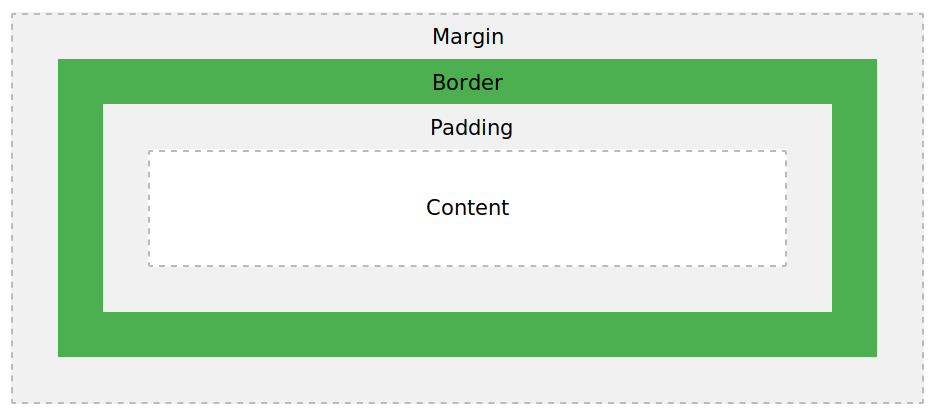

> **本文“发表于微博自媒体”，微博：[@钻石草帽](https://weibo.com/strawhatchan)**

# 内容提要
**本文采用知识库的方式，记录CSS以下各方面内容：**
1. 相关概念
2. 一般样式和高级样式（按照样式类型安排内容）
3. 其他内容，包括反应式和格子框
4. 参考资料

# 概述
- CSS是一门用于描述HTML元素显示方式的语言
    - 发明原因。由于HTML无法给网页添加标签，而是描述网页内容，比如`<h1>This is a heading</h1>`，如果要添加像``这样的标签及其属性，那么，在开发大型网站项目时，不仅有大量页面，同时每个HTML文件也将变得很长，为了实现开发目的并提高开发效率，W3C发明了CSS
    - 功能。CSS可同时控制多个页面的显示，包括设计、布局、不同设备的显示变化以及尺寸等，大幅提高设计效率
    - 文件类型。外部样式表（stylesheets）存储于`.css`文件中，只需要修改单个文件即可对整个网站的展示形式进行修改，节省了大量工作
- 语法
    - CSS语法通常是由选项（Slector）和声明（Declaration）组成，如`h1 {color:blue; font-size:12px;}`
        - `h1`表示选项，作用是基于HTML元素标签名称、id、class、属性及其他具有标识意义的内容来选择，可以理解为CSS和HTML之间的一座桥梁
        - 如果只有1个选项，选项后留1个空格，再用`{}`囊括所有声明；如果同时表示多个选项，选项之间使用`,`分隔，最后1个选项后留1个空格，再用`{}`囊括所有声明
        - `color:blue;`和`font-size:12px;`各是1个声明
        - **每个声明都由`name:value`，即“名称-值”对组成**
        - 如果`value`包含数值和单位，不能在数值和单位之间加空格符
        - 所有的声明（包括最后1个）都需要在末尾添加`;`（semicolon）作为声明与声明之间的分隔符
    - 选项类型
        - 元素标签名称，例如`
`标签中的`p`，选项写`p`
        - id，例如`id="para1"`，选项写`#para1`
        - class，例如`class="center"`，对整个类起作用时，选项写`.center`；对特定类中的特定HTML元素起作用时，如`
`元素，选项写`p.center`
    - 注释
        - 注释标记为`/* comments */`
        - 注释既可以在1行内，也可以囊括多行
    - 语法规范（如果某条语法包含多个声明，为便于阅读，应采用多行书写方式）
        - 将选项和开始的大括号置于第1行，并在开始的大括号前留一个空格
        - 在所有“名称-值”对后加上分号，包括最后一个“名称-值”对
        - 只有当值存在空格时，才使用双引号
        - 将关闭的大括号单独作为一行，且括号前不要有空格
        - 避免每行超过80个字符
- stylesheet的引用方式
    - 外部引用，链接至CSS文件，用于为大量页面设置样式。在`<head>`元素中添加`<link>`元素，如`<head><link rel="stylesheet" type="text/css" href="mystyle.css"></head>`
    - 页面引用，用于为单个页面设置独立的样式。在`<head>`元素中添加`<style>`元素
    - 行内引用，用于为HTML文件内的特定元素设定样式。在HTML元素的开始标签内添加`style`属性
    - 引用顺序
        - 行内引用覆盖外部引用和页面引用
        - 外部引用和页面引用按照排序确定覆盖关系，即在HTML文件内的`<head>`元素中“谁在后，谁起作用”
        - 如果前述3类引用方式都不存在，则使用浏览器默认样式
- 共有属性值或规范是指所有或部分样式属性都可以使用的属性值或规范
    - 共有属性值
        - initial：将属性设为默认属性
        - inherit：从父元素中继承属性
    - 共有方向属性值规范
        - 4个值：依次表示上、右、下、左
        - 3个值：依次表示上、右和左、下
        - 2个值：依次表示上和下、右和左
        - 1个值：表示所有方向都相同
    - 共有角属性值规范
        - 4个值：依次表示左上角、右上角、右下角、左下角
        - 3个值：依次表示左上角、右上角和左下角、右下角
        - 2个值：依次表示左上角和右下角、右上角和左下角
        - 1个值：表示所有角都相同
- 长度单位
    - 绝对长度
        - px（像素单位依赖于设备，对于低分辨率设备，1px为1个设备像素，但对于打印机或这高分辨率屏幕，1px意味着多个设备像素）
        - cm（厘米）
        - mm（毫米）
        - in（英尺，1in=96px=2.54cm）
        - pt（点，1pt=1/72in）
        - pc（派卡，1pc=12pt）
    - 相对长度
        - em：相对于元素的字体大小，1em表示字体大小的1倍
        - ex：相对于当前字体大小的x高度（极少使用）
        - ch：相对于0的宽度
        - rem：相对于根元素的字体大小
        - vw：相对于viewport的1%的宽度
        - vh：相对于viewport的1%的高度
        - vmin：相对于viewport小尺寸的1%
        - vmax：相对于viewport大尺寸的1%
        - %：相对于父元素的百分比

# 一般样式
## 颜色
- HTML支持140种颜色，详细信息可查阅[HTML Color Names Sorted by Name](https://www.w3schools.com/colors/colors_names.asp)或者[HTML Color Names Sorted by HEX Value](https://www.w3schools.com/colors/colors_hex.asp)
- 颜色属性
    - 背景颜色：backgroud-color
    - 文本颜色：color
    - 边框颜色：border
- 颜色的表示方式：RGB、HEX、HSL、RGBA、HSLA
    - RGB的格式为`rgb(red, green, blue)`，其中，`red`、`green`和`blue`的取值范围均为[0,255]
    - HEX的格式为`#rrggbb`，其中，`rr`、`gg`和`bb`的取值为[0,255]的十六进制数值
    - HSL的格式为`hsl(hue, saturation, lightness)`，其中，`hue`的取值范围为[0,360]，`saturation`的取值范围为[0%, 100%]，`Lightness`的取值范围为[0%, 100%]
    - RGBA的格式为`rgba(red, green, blue, alpha)`，其中，`alpha`表示透明度，取值范围为[0.0,1.0]
    - HSLA中的格式为`hsla(hue, saturation, lightness, alpha)`，其中，`alpha`表示透明度，取值范围为[0,1]

## 背景
- background背景属性用于为元素定义背景
    - 背景属性可以在一行中设定，只需要按照顺序填写背景属性下各属性的值即可，即`background: bg-color bg-image position/bg-size bg-repeat bg-origin bg-clip bg-attachment initial|inherit;`
- 背景属性下的属性（按前述属性的顺序）
    - 颜色：backgroud-color
        - color：颜色名称
        - transparent：透明
    - 图片：backgroud-image，注意不要使用影响文本显示的图片
        - url('URL'):设定图片URL
        - none：没有背景图片
        - linear-gradient()：线性渐变，至少定义2种颜色（从上到下）
        - radial-gradient()：径向渐变，至少定义2种颜色（中心到边缘）
        - repeating-linear-gradient()：重复线性渐变
        - repeating-radial-gradient()：重复径向渐变
    - 位置：backgroud-position
        - left top
        - left center
        - left bottom
        - right top
        - right center
        - right bottom
        - center top
        - center center
        - center bottom
        - x% y%：百分比位置，左上角为0% 0%，右下角为100% 100%，x控制水平，y控制垂直
        - xpos ypos：像素位置，单位px，左上角0 0，右下角为最大的水平和垂直像素数值，xpos控制水平，ypos控制垂直
    - 大小：background-size
        - auto：默认属性，展示原始尺寸
        - length：设定宽和高，需要2个数值，第1个数值控制宽度，第2个数值控制高度
        - percentage：根据父元素的宽和高设定百分比，需要2个数值，第1个数值控制宽度，第2个数值控制高度
        - cover：改变背景图片大小覆盖整个容器
        - contain：改变图片到小，以展示整个图片
    - 重复：backgroud-repeat
        - no-repeat：不重复
        - repeat-x：水平重复
        - repeat-y：垂直重复
    - 位置的起始位置：background-origin
        - padding-box：默认选项，左上角填充区域开始
        - border-box：左上角边框区域开始
        - content-box：左上角文本区域开始
    - 延伸界限：background-clip
        - padding-box：延伸到填充区域
        - border-box：默认选项，延伸到边框区域
        - content-box：延伸到文本区域
    - 滚动：backgroud-attachment
        - scroll：默认选项，随页面滚动
        - fixed：不随页面滚动
        - local：随元素内容滚动
    - 多图层展示：background-blend-mode
        - normal：默认选项，含多个图层时选择最上的图层
        - multiply：展示所有图层
        - screen
        - overlay
        - darken
        - lighten
        - color-dodge
        - saturation
        - color
        - luminosity

## 边框
- 边框样式：border-style
    - dotted：点
    - dashed：短线
    - solid：实线
    - double：双层线
    - groove：槽边框（右和下阴影）
    - ridge：岭边框（左和上阴影）
    - inset：边框右和下淡化
    - outset：边框左和上淡化
    - none：无边框
    - hidden：隐藏边框
    - mix：混合型边框，遵循共有方向属性值规范，用空格分隔
- 边框宽度：border-width
    - 数字+长度单位，如10px、10cm
    - 字符
        - medium：默认属性，中型边框
        - thin：细型边框
        - thick：粗型边框
    - 遵循共有方向属性值规范
- 边框颜色：border-color
    - color：颜色名称
    - transparent：透明
    - 遵循共有方向属性值规范
- 边框组合：border-collapse
    - separate：默认选项，单元格和表格都是独立的边框
    - collapse：单元格和表格共用1个边框
- 边框间隔：border-spaceing
    - 1个数值+长度单位的值：表示水平和垂直间隔相同
    - 2个数值+长度单位的值：第1个控制水平间隔，第2个控制垂直间隔
- 边框四角半径：border-radius
    - 数字+长度单位，如10px、10cm
    - 百分比符号%
    - 遵循共有角属性值规范
- 图片边框：border-image
    - 既可在一行中调用，如`border-image:source slice width outset repeat|initial|inherit;`，也可分开调用
    - border-image-source：设定资源
        - none：无图片
        - URL：图片URL
    - border-image-slice：切片，将图片源切成9个部分，包括4个角、4个边、1个中心，4角和4边不透明，中心透明，但如果使用fill参数，中心由透明变为不透明；切片后的图片与边框之间的关联机制：首先，将整个边框和边框包围的内容理解成“内容中心+4个角+4个边”的9个部分；其次，将切片图片的4个角分别放在边框的4个角，不执行其他操作；然后，将切片图片的4个边分别放在边框的4个边，中心放在中心，可以执行重复、平铺操作；最后，如果包含fill参数，则将中心从透明变成不透明
        - 数值（不带单位，默认单位为px）：可以有4值，如果第4个值忽略，则与第2个值相同；如果继续忽略第3个值，则3和1相同，4和2相同；如果继续忽略第2个值，则都相同；4个值依次表示，从上向下切一刀的位置、从右向左切一刀的位置、从下向上切一刀的位置、从左向右切一刀的位置，一张图片切4刀后即分成9个部分
        - 百分比：可有4个值，含义与数值类似，只是按照百分比表示
        - fill：对中心区域是否透明的控制参数，有该参数表示不透明，反之则反，用空格与数值或百分比分隔
    - border-image-width：边框的宽度
        - 数值+像素单位：像素宽度，可以有4个值
        - 数值：相应边框的倍数，可以有4个值
        - 百分比：与切片图像相应边的比例，上下为垂直比例、左右为水平比例，可以有4个值
        - auto：与切片图像的固有宽度和高度相适应
        - 有4个值的属性值遵循共有方向属性值规范
    - border-image-outset：边框向外延伸的距离
        - 数值+像素单位：像素宽度，可以有4个值
        - 数值：相应边框宽度的倍数，可以有4个值
        - 有4个值的属性值遵循共有方向属性值规范
    - border-image-repeat：图片重复的方式
        - stretch：拉伸
        - repeat：简单重复图片以填满整个边框
        - round：简单重复，但如果相应图片切片部分不是以整数个图片填满整个边框，则重新调整图片大小，直到以整数个图片填满整个边框
        - space：简单重复，但如果相应图片切片部分不是以整数个图片填满整个边框，则重新调整空间大小，以使整个边框由整数个图片填满
- 控制不同方向的边框
    - border-top|right|bottom|left分别控制上、右、下、左的边框，调用模式为`border-top|right|bottom|left: border-width border-style border-color|initial|inherit;`
    - 每一个方向控制下都有width|style|color属性，即border-top|right|bottom|left-width|style|color，调用方式与width|style|color属性相同
    - top和bottom都有2个额外属性，即border-top|bottom-right|left-radius，用于控制边框4个角的半径，调用方式与radius属性相同

## 边框向外的扩展距离
- 边框向外的扩展距离：margin
    - 数值+长度单位：各个方向边框向外的扩展距离，默认值为0，允许负数，可以有4个值，遵循共有方向属性值规范
    - 百分比：所含元素内容宽度的百分比
    - auto：浏览器自行计算边界
- 不同方向上边框向外的扩展距离：margin-top|right|bottom|left分别控制上、右、下、左边框向外的扩展距离，调用方式与margin相同

## 边框内扩展内容边界
- 边框内扩展内容边界：padding
    - 数值+长度单位：边框内扩展内容边界的长度和宽度，默认值为0，可以有4个值，遵循共有方向属性值规范
    - 百分比：所含元素内容宽度的百分比
- 在不同方向上边框内扩展内容边界：padding-top|right|bottom|left分别控制向上、右、下、左扩展的距离，调用方式与padding相同

## 元素高与宽
- 元素的高：height
    - auto：浏览器计算高，默认选项
    - 数值+长度单位：元素的高
    - 百分比：块的高度百分比
- 元素的高：width
    - auto：浏览器计算宽，默认选项
    - 数值+长度单位：元素的宽
    - 百分比：块的宽度百分比
- 最大的高/宽：max-height/width
    - none：无最大高/宽，默认选项
    - 数值+长度单位：元素的最大高/宽
    - 百分比：块的最大高/宽百分比
- 最小的高/宽：min-height/width
    - 数值+长度单位：元素的最小高/宽，默认值为0
    - 百分比：块的最小高/宽百分比

# 高级样式

# 其他内容
包括反应式和格子框共2部分内容
## 反应式

## 格子框

# 版本记录

# 微博发布